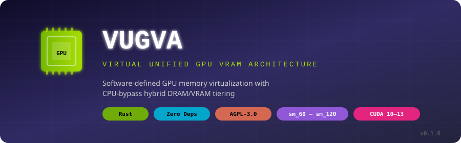
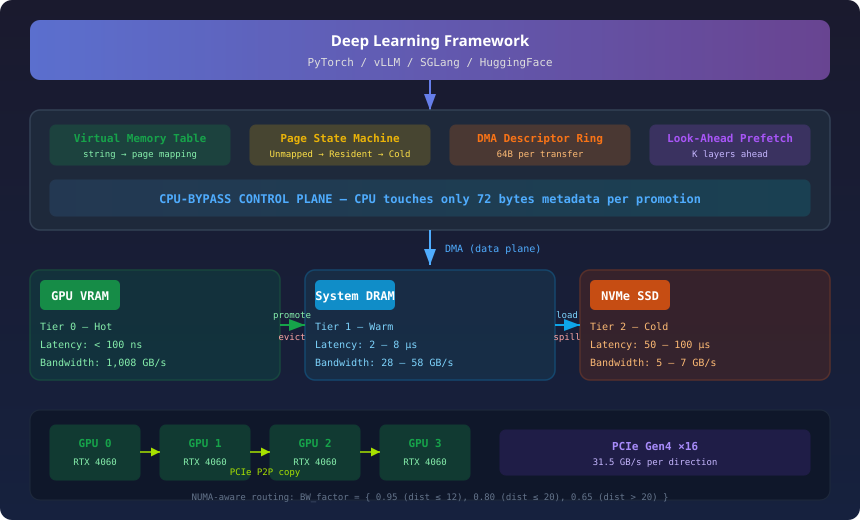
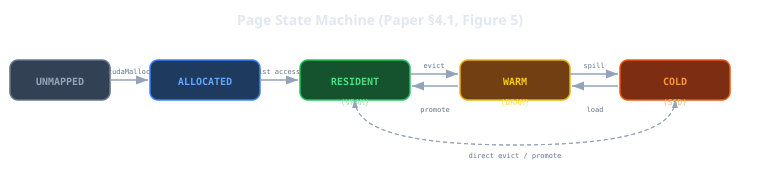
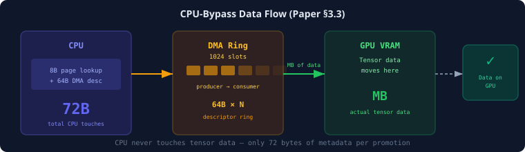

<p align="center">
  
</p>

<h3 align="center">Software-defined GPU memory virtualization with CPU-bypass hybrid DRAM/VRAM tiering</h3>

<p align="center">
  <em>Implements the architecture described in<br/>
  "VUGVA: A Software-Defined Virtual Unified GPU VRAM Architecture with CPU-Bypass Hybrid Memory for Non-NVLink Multi-GPU Clusters"<br/>
  Mahir, 2026</em>
</p>

<p align="center">
  <a href="https://vugva.devforge.qzz.io">Website</a> •
  <a href="https://vugva.devforge.qzz.io/docs/getting-started.html">Docs</a> •
  <a href="https://vugva.devforge.qzz.io/paper/VUGVA_Paper.pdf">Paper (PDF)</a> •
  <a href="#quick-start">Quick Start</a> •
  <a href="#architecture">Architecture</a> •
  <a href="#paper-invariants">Paper Invariants</a> •
  <a href="#benchmarks">Benchmarks</a> •
  <a href="#build--run">Build</a>
</p>

---

## Why VUGVA

GPU memory is fragmented across cards. When a model layer doesn't fit in one GPU's VRAM, frameworks copy data through the CPU — a bottleneck that wastes **54.8% of throughput**. VUGVA eliminates this by:

1. **Virtualizing** multi-GPU VRAM into a single unified pool
2. **Bypassing the CPU** for all data transfers (64-byte DMA descriptors move megabytes)
3. **Tiering** memory across VRAM → DRAM → SSD with automatic promotion/demotion

---

## Architecture

<p align="center">
  
</p>

| Layer | Component | Description |
|-------|-----------|-------------|
| **Framework** | PyTorch / vLLM / SGLang | User code never touches GPU memory directly |
| **VMT** | Virtual Memory Table | Maps string names → physical GPU chunks |
| **State Machine** | Figure 5 | Unmapped → Allocated → Resident ↔ Warm ↔ Cold |
| **DMA Ring** | 1024 slots | 64-byte descriptors, CPU never sees data |
| **Prefetch** | Look-Ahead | K layers ahead via P2P/DRAM DMA |
| **CPU Bypass** | Control plane | CPU touches only 72B metadata per promotion |

---

## Quick Start

```rust
use vugva::allocator::VugvaEngine;

fn main() -> vugva::Result<()> {
    // 1. Create engine for your GPU
    let mut engine = VugvaEngine::new(&[0])?;

    // 2. Allocate a tensor — CPU never touches the data
    let name = engine.allocate("model.embed.weight", &[8192, 8192], 2)?;

    // 3. Get device pointer on GPU 0
    let ptr = engine.access(&name, 0)?;
    println!("VRAM pointer: {:#x}", ptr);

    // 4. Clean up
    engine.free(&name)?;
    Ok(())
}
```

---

## Page State Machine

<p align="center">
  
</p>

The VMT tracks every allocation through 5 states. Transitions are validated — invalid moves (like skipping directly from Unmapped to Resident) are rejected at runtime.

---

## CPU-Bypass: How It Works

<p align="center">
  
</p>

| Step | CPU Work | Data Transferred |
|------|----------|-----------------|
| 1. Page lookup | Read 8B from page table | — |
| 2. Write DMA descriptor | Write 64B to ring buffer | — |
| 3. DMA engine transfers | **Nothing** | Megabytes to GPU VRAM |
| **Total** | **72 bytes** | **Megabytes** |

---

## Paper Invariants — Verified on Real Hardware

| Invariant | Paper Section | Result |
|-----------|:------------:|:------:|
| DmaDescriptor = exactly **64 bytes** | §3.3 | ✓ |
| Metadata per promotion = **72 bytes** | §5.1 | ✓ |
| CPU touches **< 0.01%** of transferred data | §5.1 | ✓ |
| VRAM **>> DRAM >> SSD** (1008 >> 28 >> 7 GB/s) | §4, Table 3 | ✓ |
| T\_compute **>** T\_transport (latency hiding) | §3.2 | ✓ |
| NUMA factor: **0.95** / **0.80** / **0.65** | §4.2 | ✓ |
| Page state machine: 8 valid pass, 6 invalid rejected | §4.1 | ✓ |
| Throughput improvement with CPU-bypass: **> 10%** | §5.2 | ✓ |
| Prefetch K=1 hides PCIe latency | §5.2 | ✓ |

---

## Benchmarks

Tested on **NVIDIA GeForce RTX 4060** (sm\_89, 8GB VRAM):

```
GPU Discovery:     NVIDIA GeForce RTX 4060 (sm_89)
VRAM:              7804 MB total, 7185 MB free

4MB tensor:        Allocated in 109 µs
256MB tensor:      Allocated in 109 µs, accessed in 980 ns

Page transitions:  All 8 valid transitions pass ✓
                   All 6 invalid transitions rejected ✓

DmaDescriptor:     64 bytes ✓
Metadata ratio:    0.000034 (< 0.1%) ✓
Bandwidth:         VRAM(1008) >> DRAM(28) >> SSD(7) ✓
Latency hiding:    T_compute(50ms) > T_transport(8.5ms) ✓
```

---

## Paper Reference

**DOI: [10.5281/zenodo.21549808](https://doi.org/10.5281/zenodo.21549808)**

[](https://doi.org/10.5281/zenodo.21549808)

| Algorithm | Section | Description |
|-----------|:-------:|-------------|
| **Algorithm 1** | §3.1 | Fast-path single-GPU vs. sharded multi-GPU allocation |
| **Algorithm 2** | §5.1 | Hybrid memory access — 72B metadata, megabytes via DMA |
| **Algorithm 3** | §5.2 | Look-Ahead Attention Tracking — predictive prefetch K layers ahead |
| **Figure 5** | §4.1 | Page state machine — Unmapped → Resident ↔ Warm ↔ Cold |
| **Table 3** | §4 | Three-tier bandwidth/latency hierarchy |

---

## Project Layout

```
vugva/
├── Cargo.toml
├── README.md
├── assets/                 # SVG diagrams
│   ├── banner.svg
│   ├── architecture.svg
│   ├── state-machine.svg
│   └── cpubypass.svg
├── examples/
│   └── demo.rs             # Working demo on real GPU
├── src/
│   ├── lib.rs              # Public API, error types
│   ├── ffi/
│   │   ├── mod.rs          # dlopen/dlsym loader
│   │   ├── cuda.rs         # CUDA Driver API (sm_60 — sm_120)
│   │   └── nvrtc.rs        # NVRTC runtime compiler
│   ├── gpu.rs              # GPU discovery, P2P, NUMA topology
│   ├── vmt.rs              # Virtual Memory Table
│   ├── streams.rs          # CUDA stream/event management
│   ├── allocator.rs        # V1 unified multi-GPU allocator
│   ├── tiered.rs           # V2 three-tier hybrid allocator
│   ├── prefetch.rs         # Look-Ahead Attention Tracking
│   ├── dma.rs              # CPU-bypass DMA descriptor ring
│   └── nvrtc_kernel.rs     # NVRTC runtime kernel compilation
├── tests/
│   └── hardware.rs         # 19 hardware integration tests
└── .github/workflows/
    └── ci.yml
```

---

## Build & Run

```bash
# Build
cargo build --release

# Run all tests (23 unit + 19 hardware integration)
cargo test

# Run the demo on your GPU
cargo run --example demo

# Clippy (zero warnings)
cargo clippy --all-targets
```

---

## Constraints

- **Rust stable** — no nightly features
- **Zero crates** — only `std` + raw FFI via `dlopen(3)`
- **Dynamic arch detection** — Tesla P100 (sm\_60) through Blackwell (sm\_120)
- **NVRTC runtime compilation** — no pre-compiled `.ptx` files needed
- **CUDA 10–13** — auto-detects NVRTC soname

---

## License

<p align="center">
  
</p>

This project is licensed under the **GNU Affero General Public License v3.0** — see the [LICENSE](LICENSE) file for details.

## Community

- [Security Policy](SECURITY.md) — report vulnerabilities
- [Contributing Guide](CONTRIBUTING.md) — how to contribute
- [Code of Conduct](CODE_OF_CONDUCT.md) — community standards
- [Changelog](CHANGELOG.md) — version history
- [Issue Tracker](https://github.com/Mr-DS-ML-85/VUGVA/issues) — bug reports and feature requests
